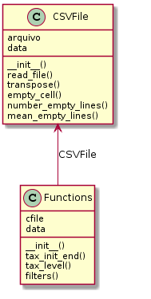

# python-csv

### Exercício: coleta e ordenação de dados ICMBIO

1. Para cada coluna identique a quantidade de linhas com dados faltantes (em alguns casos, o dado faltante é uma string vazia, em outros casos é uma string contendo algum valor do tipo: "sem informação"). Faça um método que retorna a média de dados faltantes por coluna
`ok`

2. Para cada item identifique até qual nível taxônomico a ocorrência foi identificada.efinem a espécie: Filo;Classe;Ordem;Familia;Genero;Especie do mais genérico (Filo) para o mais específico (Especie), é comum que em alguns casos, o preenchimento pare em família ou genêro por exemplo.
`ok`
3. Monte filtros de ocorrências por estados, nome de espécie (nome exato ou parte do nome) e categoria de ameaça, e outros filtros que julgar relevante.
`ok`
4. Crie uma funcionalidade para avaliar se a informação de longitude e latitude corresponde a informação presente na localização, para isso você pode utilizar uma biblioteca de consulta reversa de lat/log como por exemplo o https://opencagedata.com/tutorials/geocode-in-python
`implementado` *TODO: Classificação e ordenação das células que estão com informações geográficas incorretas*

**fonte do exerício:**

https://github.com/advinstai/python/blob/master/Exercicios/

### UML

O _Release_ é feito Orientado a Objeto. Temos duas classes: A CSV_File que abre os arquivos e converte em *Data Frame* e o Funcitons que faz o processamento dos dados.

